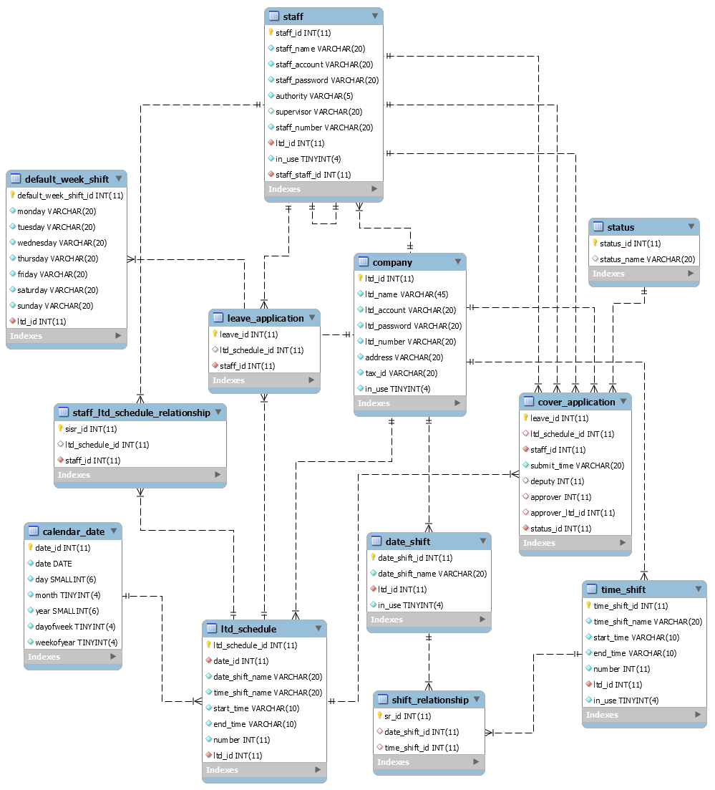

# README #

This README would normally document whatever steps are necessary to get your application up and running.

## Bunny Shift Backend
use node.js with MySQL

## how to ues API
https://hackmd.io/ehRbDHcCTXqvynCWQrrzLw

## ER model

